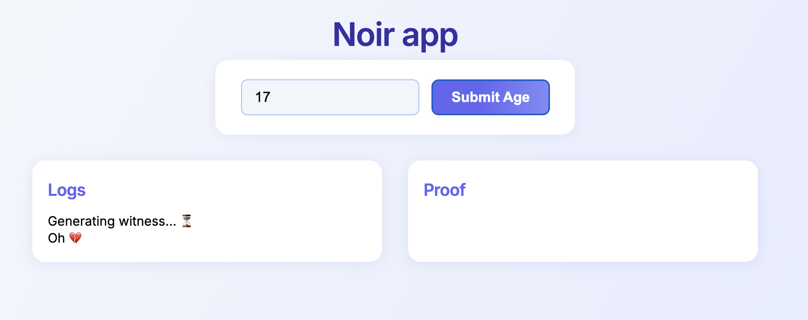
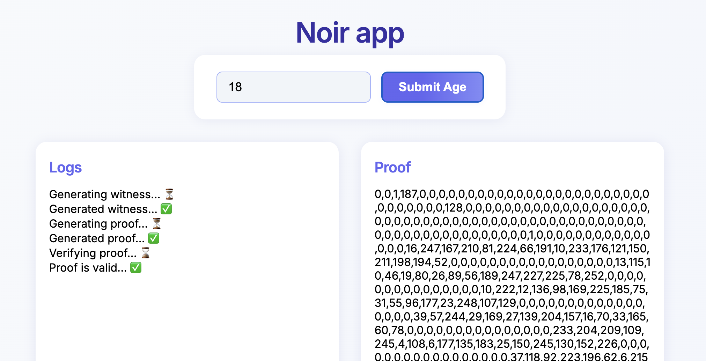

# Noir Web App

A simple web app demo using Noir for zero-knowledge proofs.

## Features

- Enter your age and submit to generate a proof.
- View logs and proof output in real time.
- Clean, modern UI.

### Under 18 Example

### Over 18 Example

---

Built with Noir, HTML, and JavaScript.
